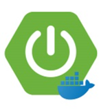
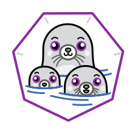

<p align="center">
	
	
      
  <h1 align="center">Build Spring boot application with Docker(Podman) and ZK Framework and Quartz Scheduler</h1>
</p>

[](https://maven.apache.org/)
[](https://docs.aws.amazon.com/corretto/latest/corretto-21-ug/downloads-list.html)
[](https://spring.io/projects/spring-boot)
[](https://spring.io/projects/spring-security)
[](https://mybatis.org/mybatis-3/)
[](https://swagger.io/)
[](https://www.docker.com/)
[](https://podman.io/)
[](https://github.com/zkoss/zk/actions?query=workflow%3Azk-build) [](https://maven-badges.herokuapp.com/maven-central/org.zkoss.zk/zk) [](https://codeclimate.com/github/zkoss/zk)
[](https://www.quartz-scheduler.org/)

## About Project 
This is a simple spring boot application with the basic details of docker(podman) and ZK Framework implementation and Quartz Scheduler.

## Repository contains 

## BackEnd 
  * [JDK Amazon Corretto 21](https://aws.amazon.com/tw/corretto/?filtered-posts.sort-by=item.additionalFields.createdDate&filtered-posts.sort-order=desc)
  * Spring MVC source code.
  * Spring boot application source code.
  * Spring security source code.
  * MyBatis ORM.
  * Swagger 3.0 ui.
  * [Podman](https://podman.io/)
  * Docker Hub.
  * Quartz Scheduler

## FrontEnd 
  * Spring-Thymeleaf
  * [ZK](http://www.zkoss.org/)

## Project Management Tool
  * Apache Maven 

## How to use the ZK Framework
  * [Tutorial](http://books.zkoss.org/wiki/ZK_Getting_Started/Tutorial)
  * [ZK Essentials](http://books.zkoss.org/wiki/ZK_Essentials)
  * [ZK Developer's Reference](http://books.zkoss.org/wiki/ZK_Developer%27s_Reference)
  * [Javadoc API](http://www.zkoss.org/javadoc/latest/zk/)
  * [More](http://books.zkoss.org)

## How it works using docker(podman) container
#### First choose 
  * Create a simple spring boot application.
  * Create a docker file under parent directory.
  * Paste the following code in the dockerfile.
#### Second choose
  * Create a simple spring boot application.
  * Create a docker-compose.yml under parent directory.
  * Paste the following code in the docker-compose.yml.

#### Dockerfile: 
```
FROM amazoncorretto:21
WORKDIR /app
COPY target/work-practice-1.0-SNAPSHOT.jar app.jar
EXPOSE 8080
ENTRYPOINT ["java", "SPRING_PROFILES_ACTIVE=dev","-jar", "app.jar"]
```

#### docker-compose.yml

```
version: '1.0'

services:
  db:
    image: postgres:14.12
    container_name: nice_zhukovsky
    environment:
      POSTGRES_DB: postgres
      POSTGRES_USER: postgres
      POSTGRES_PASSWORD: mysecretpassword
    ports:
      - "5433:5432" # 將宿主機的5433端口映射到容器的5432端口
  app:
    image: spring.app:1.0
    container_name: springproject
    environment:
      SPRING_DATASOURCE_URL: jdbc:postgresql://localhost:5433/postgres
      SPRING_DATASOURCE_USERNAME: postgres
      SPRING_DATASOURCE_PASSWORD: mysecretpassword
    depends_on:
      - db
    ports:
      - "8080:8080"
```

* Go to the spring boot application root directory open the cmd and create jar file using following command
First: ```mvn clean```
Second: ```mvn package```
Finally: The .jar file will create on the target package.
### Docker Commands
* Execute the following docker command to create the docker images.<br>
* ```docker buile -t <imagename> .```
  * Here "-t" is used fo mention the tag of container.
  * Our docker file is present in the same directory where we are executing this command. That is why we mention a dot as last of to commend
* To list the created docker images please use the following command. And make sure that our docker image is in the list.
  ```docker image ls``` or
  ```docker images```
* Now it is time to run the docker image. Use the following command to run the docker image.<b>
  ```docker run -p 8080:8080 <imageanme>```
  * Here java application will be running inside the docker container , so we need to expose the application running port to outside the container. "-p 8080:8080" is the command which expose the port to outside the docker container.
### Thanks :)